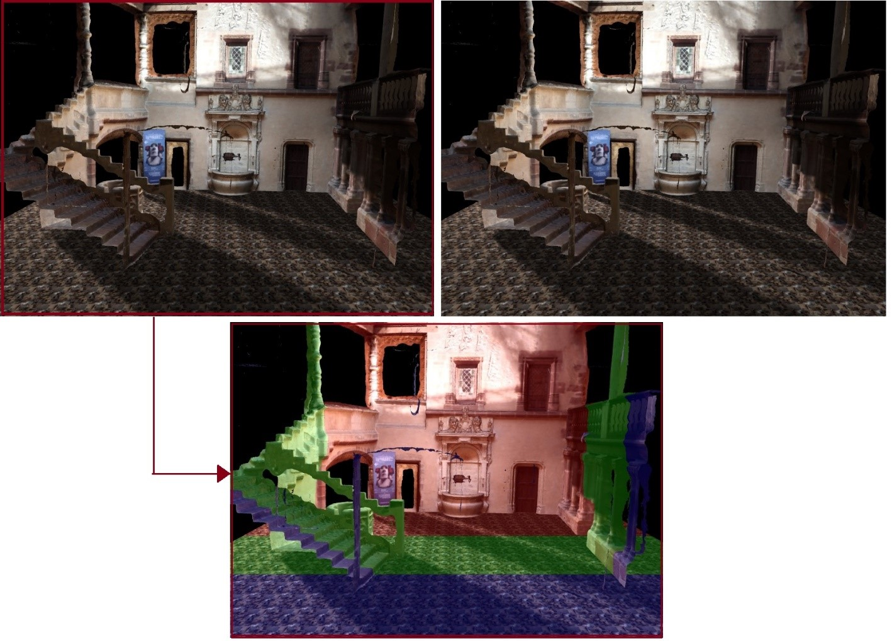
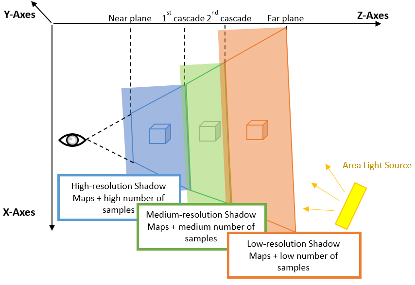
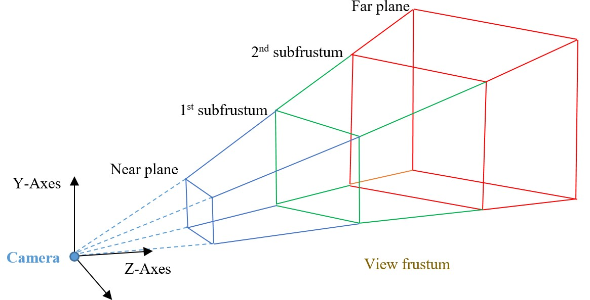
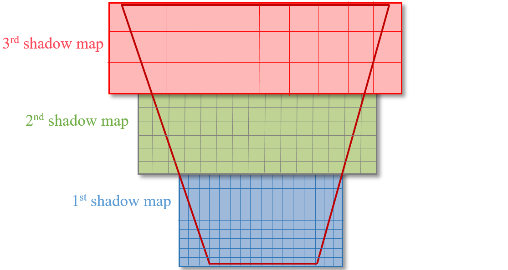
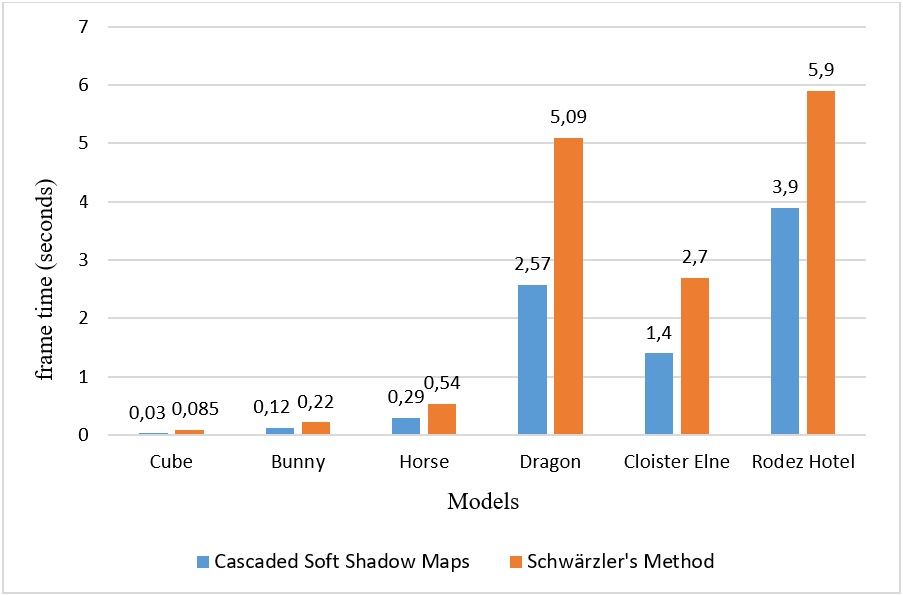
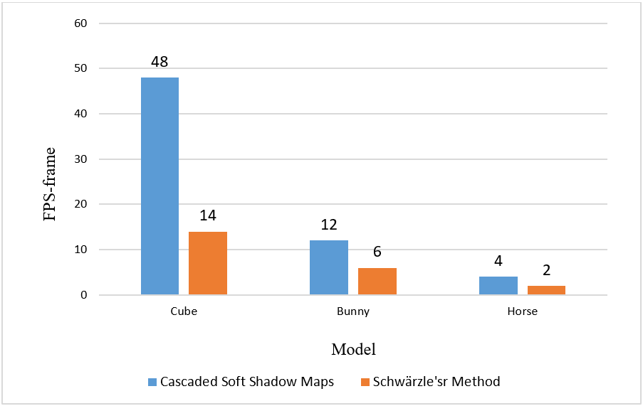
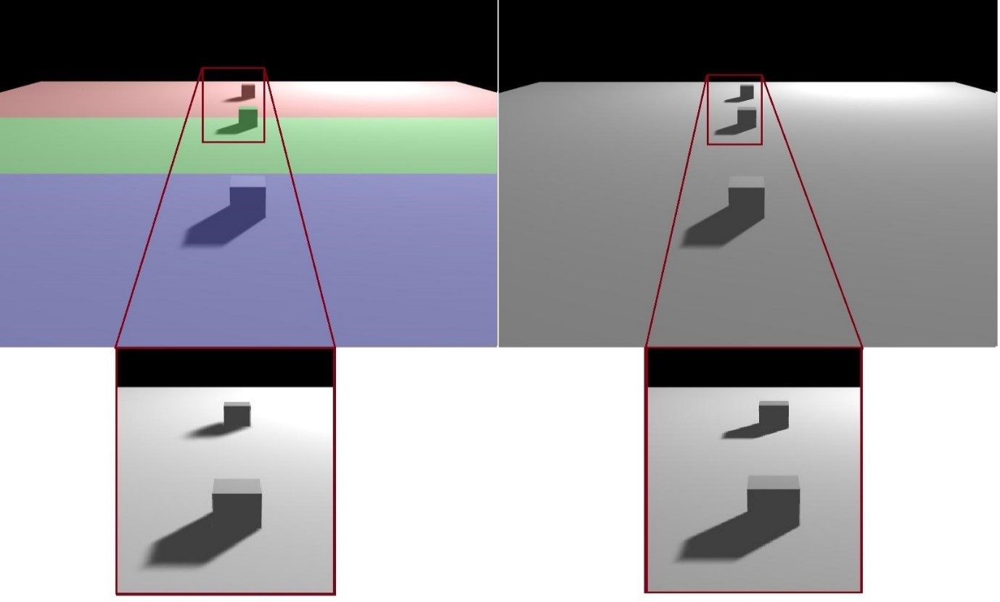
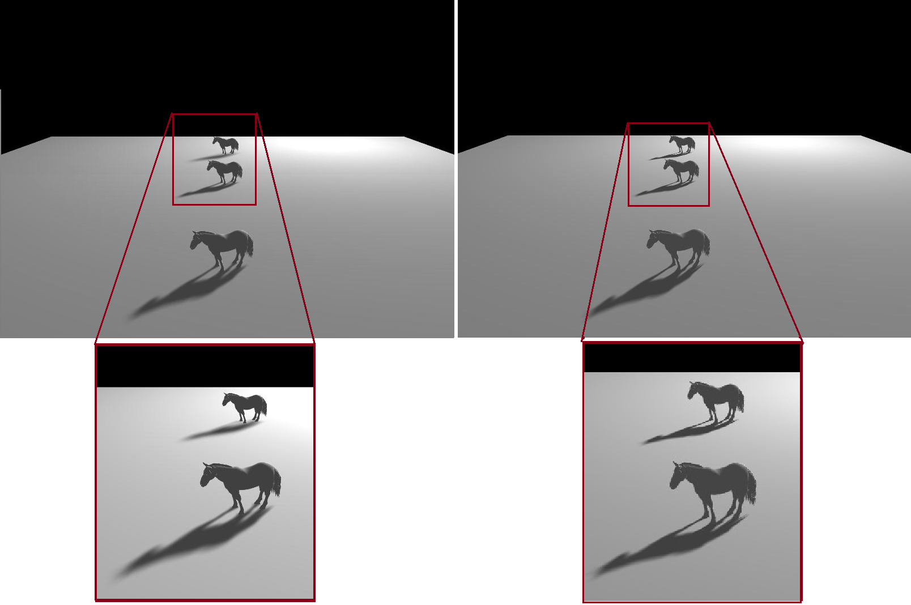

# Computer Graphics
## Cascaded Soft Shadow Maps Based on PCF Filtering

 

**Language used is C++, Opengl Version 2.02, GLSL Version 120. / Visual Studio 2010.**

[Cascaded_Soft_Shadow_Maps](https://github.com/NadiaAzri/Cascaded_Soft_Shadow_maps/tree/main/Cascaded_Soft_Shadow_Maps) file for our technique.

[Soft_Shadow_Maps](https://github.com/NadiaAzri/Cascaded_Soft_Shadow_maps/tree/main/Soft_Shadow_Maps) file for Schwärzler’s method.

Basic code from [3dcpptutorials](http://www.3dcpptutorials.sk/index.php?id=27) 

## The technique.
Physically accurate soft shadows in real-time applications can be imitated by subdividing the area light source into multiple samples and creating a shadow map for each sample and then accumulating them. 

 

In this work, we fitted in this context, and we proposed a new technique to reduce the rendering time required to achieve a high quality of soft shadows in real-time rendering. We generated physically accurate soft shadows using the Cascaded Shadow Maps technique (CSMs) to reduce further the samples of the area light source on far cascades, and use multiple implemented PCF filters on the GPU which allowed us reducing the samples by removing the artifacts and soften the resulting soft shadows. 
 

## Results & Comparative study.
The proposed technique is inspired by the work carried out by Schwärzler et al. and consists in reducing the number of area light source samples to the maximum
for soft shadows that are physically accurate in real-time.

Both the CSMs technique and the PCF filtering freed-up significant computing time.

We compared the results of our cascaded soft shadow maps technique and Schwärzler’s method using different models with different sizes..We presented the results of the implementation where different measurements of performance and visual quality will be compared and reviewed. To compare our results, we chose the standard criterion of FPS (Frame Per Second) and the time required to generate an image. We evaluated the proposed technique using the RMSE (Root Mean Square Error) metric.

The results show that our technique improves efficiency by creating high-quality soft shadows in real-time, and is undoubtedly faster than traditional techniques.

